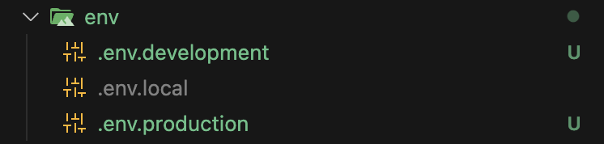

# 프로젝트 세팅 정보

### 1. ESLINT, PRETTIER 설정

NEXT JS를 사용하는 경우, ESLINT 는 자동으로 설정 되어 있지만 추가적인 내용을 포함하기 위해 아래 내용을 설명한다.

[참고 블로그](https://velog.io/@kuwon15/NextJS-13-Prettier-ESLint-Recoil-%EC%B4%88%EA%B8%B0-%EC%84%B8%ED%8C%85-%ED%95%98%EA%B8%B0)

  <details>
    <summary>세팅방법 접기/펼치기 </summary>
    <div markdown="1">

- ### vscode 에서 tab 넓이 2칸으로 변경
  Cmd + Shift + p => 입력창에 tab 이라고 입력 => Change tab display size 2로 변경
- ### prettier 설치

  ```Shell
  # 개발 모드 prettier 설치
  yarn add prettier -d

  # 설정 파일 생성 및 세팅
  echo -e '{\n  "semi": false,\n  "singleQuote": true,\n  "trailingComma": "all",\n  "useTabs": false,\n  "tabWidth": 2,\n  "printWidth": 80,\n  "arrowParens": "always"\n}' > .prettierrc

  ```

- ### prettier .gitignore 파일 적용 해제

  ```JSON
  "scripts": {
    ...
    "format": "prettier --check --ignore-path .gitignore .",
    "format:fix": "prettier --write --ignore-path .gitignore ."
  },

  ```

- ### ESLint 세팅
- airbnb : airbnb사에서 쓰고 있는 ESLint 규칙이 포함되어있는 확장이다. 다음 명령어로 설치할 수 있다.

  ```
  yarn add eslint-config-airbnb -d
  ```

- airbnb-typescript : airbnb 규칙을 typescript에서도 사용하기 위한 확장이다. typescript는 parsing이 필요하기 때문에 @typescript-eslint/eslint-plugin @typescript-eslint/parser 들과 함께 설치 해야 하며 "parserOptions"를 설정해야 한다.

  ```
  yarn add eslint-config-airbnb-typescript @typescript-eslint/eslint-plugin@^6.0.0 @typescript-eslint/parser@^6.0.0 -d
  ```

- prettier : Prettier과의 충돌을 방지하는 확장이다. Prettier를 따로 사용하고 있기에 설정이 필요하였다. 다음 명령어로 설치할 수 있다.

  ```
  yarn add eslint-config-prettier -d
  ```

  또한 "react/react-in-jsx-scope" 규칙을 꺼버린 것을 볼 수 있다. 이는 jsx, tsx 파일에 React를 import하지 않으면 나타나는 에러인데 최신 React나 NextJS에서는 React를 import 하지 않아도 되기 때문에 규칙을 꺼버렸다.

    </div>
  </details>

### 2. 아토믹 디자인 패턴을 활용한 패키지 구조 정리

- 공통으로 사용하는 컴포넌트와 이외의 것들은 /src 하위 폴더에 만들고, /src/app/{기타경로} "기타경로" 에서 각각이 필요한 컴포넌트 형태가 다를 수 있기 때문에
  아토믹 디자인 형태를 일부분 차용하였다.

  맞는지는 모르겠지만 DDD와 아토믹 디자인 패턴 섞어 적용해보았다.

  ```Shell
  ├── app # app 하위 폴더는 nextjs 라우팅 경로로 인지한다. (DDD 및 아토믹 디자인 참고하여 폴드 구조화 하였다.)
  │   ├── (route) # 소괄호를 넣을 경우 nextjs 경로로 인지하지 않는다. 하위 내용은 경로로 인지할 수 있으며, 라우팅 그룹을 나누고자할때 사용 ex) (admin), (user)
  │   ├── favicon.ico
  │   ├── globals.css
  │   ├── layout.tsx
  │   ├── page.tsx # "/" 경로에 그려질 내용이 담긴다.
  │   └── posts # app 하위에 폴더를 만들게 되면 라우팅이 된다. ex) /posts
  │       ├── _components # 폴더 이름 앞에 "_" 붙이 게되면 경로로 인식하지 않는다.
  │       │   ├── molecules
  │       │   │   └── index.ts
  │       │   └── organisms
  │       │       └── index.ts
  │       ├── _hooks
  │       └── _service
  │       └── page.tsx # "/posts" 호출 시 보여질 내용이 담긴다.
  ├── components # 공통으로 사용될 컴포넌트를 정의 하며, 아토믹디자인을 참고 하였다.
  │   ├── atoms # 더이상 쪼개어 질 수 없는 컴포넌트를 모아둔다.
  │   │   ├── Button.tsx
  │   │   ├── CheckBox.tsx
  │   │   ├── Div.tsx
  │   │   ├── DivColumn.tsx
  │   │   ├── DivGrid.tsx
  │   │   ├── DivRow.tsx
  │   │   ├── Icons.ts
  │   │   ├── InputComponent.tsx
  │   │   ├── LoadingSpinner.tsx
  │   │   ├── MainColumn.tsx
  │   │   ├── RadioButton.tsx
  │   │   ├── RadioButtonWithLabel.tsx
  │   │   ├── SelectBox.tsx
  │   │   ├── TextAreaComponent.tsx
  │   │   ├── Texts.tsx
  │   │   └── index.ts
  │   ├── molecules # atoms 집합 컴포넌트 1개의 기능만을 갖는다. ex) 검색창
  │   │   └── index.ts
  │   ├── organisms # atoms, molecules를 조합한 집합 컴포넌트 여러개의 기능을 갖는다. ex) 검색창을 포함한 헤더
  │   │   └── index.ts
  │   └── templates # 큰 틀을 잡는데 사용 ex) 헤더만 있는 페에지, 헤더푸터를 포함한 페이지, 푸터만 있는 페이지 등등..
  │   │   └── index.ts
  │   └── cn.ts
  ├── hooks
  │   └── useReactQuery.tsx
  ├── service
  ├── types
  └── utils
  ```

  [참고링크1 - 카카오디벨로퍼](https://fe-developers.kakaoent.com/2022/220505-how-page-part-use-atomic-design-system/)

  [참고링크2 - 아토믹디자인과 도메인주도 설계가 바탕이 되는 디자인 시스템](https://brunch.co.kr/@designsystemguy/3)

### 3. 테일윈드, tailwind-merge, cva, clsx를 활용한 리액트 컴포넌트 관리

- 다음 적용사항은 테일윈드의 조건식 넣기 까다로운 불편함과 코드가 지저분해지는 문제를 해결하기 위해 적용하였습니다.

1. 라이브러 설치

- clsx: 조건부 렌더링을 사용하기 위해 추가
- cva: 스타일 클래스를 지정해서 사용가능
- tailwind-merge: props로 받아온 className은 적용되지 않지만 tailwind-merge 라이브러리를 사용하면 가능하여 추가

[참고링크 - tailwind를 이용한 효율적인(?) React Component 관리 tailwind-merge cva clsx 파헤치기](https://velog.io/@qwzx16/tailwind%EB%A5%BC-%EC%9D%B4%EC%9A%A9%ED%95%9C-%ED%9A%A8%EC%9C%A8%EC%A0%81%EC%9D%B8-React-Component-%EA%B4%80%EB%A6%ACtailwind-merge-cva-clsx-%ED%8C%8C%ED%97%A4%EC%B9%98%EA%B8%B0)

### 4. nextjs 환경 변수 설정 (로컬, 개발, 스테이징, 운영)

- nextjs 를 실행시키기 위해 환경을 local, dev, staging, prod 환경으로 나누어 작업하는 방법을 공유한다.
  package.json 의 script 영역을 아래와 같이 작성하여준다. 아래와 같이 사용하면 환경별 분리 작업이 가능하다.

  ```json
  "scripts": {
        "lint": "next lint",
        "local:dev": "env-cmd -f ./env/.env.local next dev -p 3030",
        "local:build": "env-cmd -f ./env/.env.local next build",
        "local:start": "env-cmd -f ./env/.env.local next start -p 3030",
        "dev:dev": "env-cmd -f .env next dev -p 3030",
        "dev:build": "env-cmd -f .env next build",
        "dev:start": "env-cmd -f .env next start -p 3030",
        "staging:dev": "env-cmd -f .env.staging next dev -p 3030",
        "staging:build": "env-cmd -f .env.staging next build",
        "staging:start": "env-cmd -f .env.staging next start -p 3030",
        "prod:dev": "env-cmd -f .env.production next dev -p 3030",
        "prod:build": "env-cmd -f .env.production next build",
        "prod:start": "env-cmd -f .env.production next start -p 3030"
    },
  ```

- env 파일 생성

  
  .env.local 파일 내용

  ```env
  ENV='LOCAL'
  NEXT_PUBLIC_API_URL=https://dev-api.template.com
  # NEXT_PUBLIC_API_URL=http://192.168.1.9:9090
  NEXT_PUBLIC_WEB_URL=http://192.168.1.3:3030
  ```

### 99. API 호출 로직 정리

- 필요 라이브러리: react-query

  [참고링크1](https://soobing.github.io/react/server-rendering-and-react-query/),
  [참고링크2](https://soobing.github.io/react/next-app-router-react-query/)

  - 서버 사이드 API 호출 로직 정리

    - 참고용 개발 순서 (참고: [postService.ts](/src/app/posts/_service/postService.ts))

      1. 서비스 함수 생성
      2. api에서 리턴해주는 타입 인터페이스 생성
      3. api enpoint 생성
      4. service 함수 생성

    - 소스

    ```typescript
    // 서버 호출 로직 src/app/posts/page.tsx 참고


    import React from 'react';
    import { getPosts } from './_service/postService';
    import { DivColumn, DivRow, MainColumn } from '@/components/atoms';
    import { Body1Regular, Title1Regular } from '@/components/atoms/Texts';
    import Button from '@/components/atoms/Button';
    import Link from 'next/link';
    import LineChart from '@/components/LineChart';

    export default async function page() {
      // 데이터 호출 로직
      const data = await getPosts();

      return (
        <MainColumn className="p-4 gap-3">
          <DivRow className="gap-4">
            <Button
              variant={'grey'}
              size={'md'}
              label="서버"
              className="text-black"
            />
            <Link href={'/posts/client'}>
              <Button
                variant={'grey'}
                size={'md'}
                label="클라이언트"
                className="text-white"
              />
            </Link>
          </DivRow>
          {new Date().toString()}
          <LineChart />
          {data.map((v) => (
            <DivColumn key={v.id} className="border-b gap-2 p-3">
              <Title1Regular className="text-blue-400">{v.title}</Title1Regular>
              <Body1Regular>{v.body}</Body1Regular>
            </DivColumn>
          ))}
        </MainColumn>
      );
    }


    ```

  - 클라이언트 사이드 API 로직 정리 (React Query 사용)

    - 참고용
    - 소스 (참고: [page.tsx](/src/app/posts/client/page.tsx))

      ```typescript
      'use client';

      import { useQuery } from '@tanstack/react-query';
      import React from 'react';
      import { getPosts } from '../_service/postService';
      import { MainColumn, DivColumn, DivRow } from '@/components/atoms';
      import { Title1Regular, Body1Regular } from '@/components/atoms/Texts';
      import Button from '@/components/atoms/Button';
      import { useRouter } from 'next/navigation';

      export default function ClientPage() {
        const { data } = useQuery({ queryKey: ['posts'], queryFn: getPosts });
        const { push } = useRouter();

        return (
          <MainColumn className="p-4">
            <DivRow className="gap-4">
              <Button
                variant={'grey'}
                size={'md'}
                label="서버"
                className="text-white"
                onClick={() => push('/posts')}
              />
              <Button
                variant={'grey'}
                size={'md'}
                label="클라이언트"
                className="text-black"
                onClick={() => push('/posts/client')}
              />
            </DivRow>

            {data &&
              data.map((v) => (
                <DivColumn key={v.id} className="border-b gap-2 p-3">
                  <Title1Regular className="text-blue-400">{v.title}</Title1Regular>
                  <Body1Regular>{v.body}</Body1Regular>
                </DivColumn>
              ))}
          </MainColumn>
        );
      }

      ```
